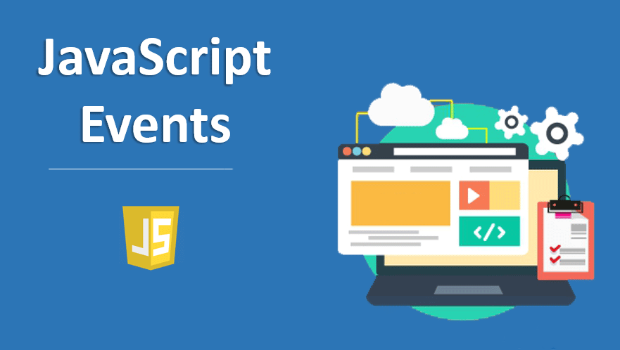

# Interact with JavaScript

 

  

  <h3 align="center">Foreword</h3>

  

    A repo to demo basic DOM interactions with JavaScript.
     
    <a href="https://github.com/jgome284/interact-js/issues">Report Bug</a>
    ·
    <a href="https://github.com/jgome284/interact-js/issues">Request Feature</a>
  

## Table of Contents

- [Interact with JavaScript](#interact-with-javascript)
  - [Table of Contents](#table-of-contents)
  - [About](#about)
  - [Getting started](#getting-started)
  - [License](#license)

## About

This repository hosts files that demonstrate event handling with JavaScript.

<!-- GETTING STARTED -->
## Getting started

1. Git clone this project to a local repository. This will provide you a copy of all files. 📄
2. Launch an application via the [html file](./html/) of your choice. 🚀
3. Investigate the [javascript code](./js/) with the same base filename, i.e. eventTypes.html, eventTypes.js, etc... 🔎
4. Play with the event listeners setup for each exercise! 🛝
5. Understand what's going on? Then move on and repeat! 🔁

## License

Distributed under the MIT License. See `LICENSE` for more information.
